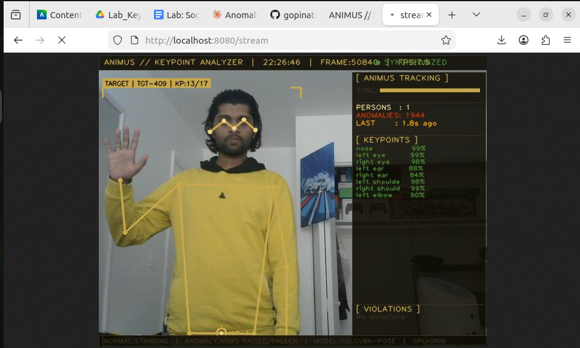
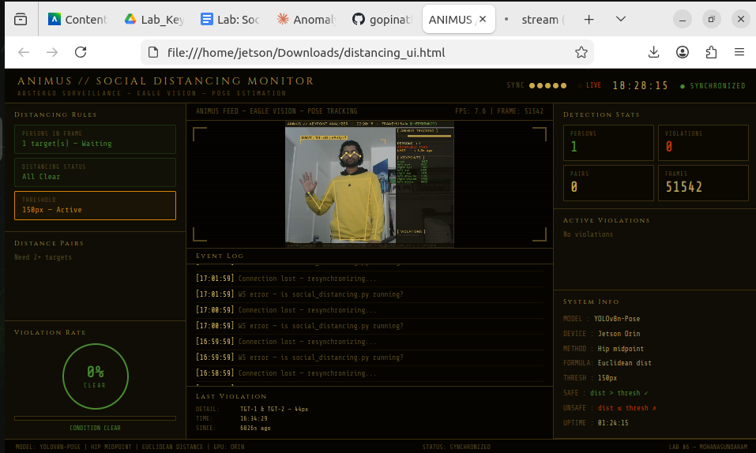

# ANIMUS — Keypoint & Social Distancing Detector
### *Assassin's Creed–Themed Real-Time Keypoint Detection + Social Distancing on NVIDIA Jetson Orin*

---

## Demo Screenshots

### Normal Pose — Gold Skeleton — All Clear
<p align="center">
  
</p>

### Anomaly Detected — Arms Raised — Red Skeleton
<p align="center">
  
</p>

### Browser UI — Animus Dashboard — Synchronized
<p align="center">
  
</p>

---

## About The Project

A **real-time human pose keypoint detection and social distancing system** running on **NVIDIA Jetson Orin (JetPack 6)** using **YOLOv8n-Pose**. The UI is inspired by **Assassin's Creed's Animus** — featuring gold-on-black Eagle Vision aesthetics, skeleton overlays, keypoint confidence bars, hip midpoint markers, and a live browser dashboard.

The system detects 17 body keypoints (COCO format), applies pose-based anomaly rules, computes social distancing using hip midpoints and Euclidean distance, logs all events to CSV, saves annotated frames, and streams annotated video to a browser via MJPEG.

> **Normal → Standing pose (gold skeleton)**
>
> **Anomaly → Arms raised above shoulders (red skeleton + CRITICAL alert)**
>
> **Social Distance → Hip midpoint Euclidean distance < threshold (red alert)**

---

## Features

| Feature | Description |
|---|---|
| **17 keypoint detection** | Full body skeleton — COCO 17 keypoint format |
| **Arms raised anomaly** | CRITICAL alert when wrists above shoulders |
| **Fallen person detection** | CRITICAL alert when hip position is very low |
| **Occlusion warning** | Warning when fewer than 8 keypoints visible |
| **Crowd detection** | Warning when >2 persons in frame |
| **Social distancing** | Hip midpoint Euclidean distance between all pairs |
| **Hip midpoint marker** | Crosshair drawn at each person's hip center |
| **Distance line** | Gold/red line drawn between hip midpoints |
| **Skeleton overlay** | Gold/red skeleton drawn on live camera feed |
| **Assassin's Creed HUD** | Animus-themed OpenCV overlay + browser dashboard |
| **MJPEG video stream** | Annotated feed streams directly into browser |
| **WebSocket dashboard** | Live data — keypoints, stats, violations, threat level |
| **Keypoint confidence bars** | Per-joint confidence visualized in browser |
| **Event log** | Timestamped anomaly log in browser |
| **CSV logging** | Every violation saved to `output/keypoint_log.csv` |
| **Auto frame capture** | Annotated frames saved on every anomaly |
| **Cooldown debounce** | Prevents duplicate log entries |

---

## Built With

- [Ultralytics YOLOv8-Pose](https://github.com/ultralytics/ultralytics) — YOLOv8n-Pose
- Python 3.10 + asyncio + websockets + aiohttp + OpenCV
- NVIDIA Jetson Orin — JetPack 6 (R36.5)
- Conda environment `dev_38`
- Assassin's Creed / Animus aesthetic

---

## Getting Started

### Prerequisites

```bash
conda activate dev_38
pip install ultralytics --index-url https://pypi.org/simple/
pip install "numpy>=1.26,<2.0" --index-url https://pypi.org/simple/
pip install lap websockets aiohttp --index-url https://pypi.org/simple/
```

### Installation

```bash
git clone https://github.com/gopinathm188/ANIMUS-Keypoint-Detector.git
cd ANIMUS-Keypoint-Detector
```

### Running

**Step 1 — Start backend on Jetson:**
```bash
conda activate dev_38
python3 keypoint_detector.py --camera 0

# Custom social distancing threshold
python3 keypoint_detector.py --camera 0 --distance 200
```

Output:
```
[MJPEG] Video stream: http://localhost:8080/stream
[WS]   ws://0.0.0.0:8765
ANIMUS // KEYPOINT + SOCIAL DISTANCING — ONLINE
```

**Step 2 — Open browser UI:**
```bash
firefox animus_ui.html
```

**Step 3 — Test poses:**
- Stand normally → gold skeleton, no alert ✅
- Raise both arms above head → red skeleton + CRITICAL ALERT 🔴
- Two people close → red distance line + violation 🔴

---

## Keypoint Map (COCO 17)

| Index | Name | Index | Name |
|---|---|---|---|
| 0 | nose | 9 | left wrist |
| 1 | left eye | 10 | right wrist |
| 2 | right eye | 11 | **left hip** |
| 3 | left ear | 12 | **right hip** |
| 4 | right ear | 13 | left knee |
| 5 | left shoulder | 14 | right knee |
| 6 | right shoulder | 15 | left ankle |
| 7 | left elbow | 16 | right ankle |
| 8 | right elbow | | |

> **Hip midpoint** = (left_hip + right_hip) / 2 — used for social distancing

---

## Anomaly Rules

```python
RULES = {
    "max_persons":         2,     # >2 persons = crowd warning
    "min_keypoints":       8,     # <8 visible = occlusion warning
    "fallen_thresh":       0.75,  # hip_y > 75% frame = fallen
    "social_distance_px":  150,   # hip distance < this = violation
    "min_confidence":      0.45,
    "cooldown_seconds":    2.0,
}
```

| Rule | Trigger | Severity |
|---|---|---|
| Arms raised | Wrist y < shoulder y | CRITICAL 🔴 |
| Fallen person | Hip y > 75% frame height | CRITICAL 🔴 |
| Social distance | Hip distance < threshold | CRITICAL 🔴 |
| Occluded | < 8 keypoints visible | WARNING 🟡 |
| Crowd | > 2 persons in frame | WARNING 🟡 |

---

## Social Distancing Logic

```python
# Hip midpoint per person (same as poseNet lab)
hip_mid = (left_hip + right_hip) / 2

# Euclidean distance between persons
distance = sqrt((x1-x2)² + (y1-y2)²)

# Violation check
if distance < DISTANCE_THRESHOLD:
    → FLAG VIOLATION — red line + alert
```

---

## Output Files

```
output/
├── keypoint_log.csv       ← timestamped anomaly events
└── keypoint_images/       ← annotated frames on detection
```

**Sample `keypoint_log.csv`:**

| timestamp | frame | rule | severity | detail | persons_in_frame |
|---|---|---|---|---|---|
| 2026-04-30T22:37:28 | 000613 | arms_raised | critical | Person 1: Arms raised above shoulders | 1 |
| 2026-04-30T22:26:46 | 050840 | occluded | warning | Person 1: Only 13/17 keypoints visible | 1 |

---

## Project Structure

```
ANIMUS-Keypoint-Detector/
├── code/
│   └── keypoint_detector.py    ← YOLOv8-Pose + Social Distancing backend
├── html/
│   └── animus_ui.html          ← Assassin's Creed Animus browser dashboard
├── output/
│   ├── keypoint_log.csv
│   └── keypoint_images/
├── docs/
│   ├── Keypoint_detector_1.png ← normal pose screenshot
│   ├── keypoint_detector_2.png ← arms raised anomaly screenshot
│   └── animus_ui.png           ← browser UI screenshot
└── README.md
```

---

## Results

| Metric | Value |
|---|---|
| Model | YOLOv8n-Pose |
| Device | Jetson Orin GPU |
| FPS | ~7.5 FPS |
| Keypoints detected | 13/17 (upper body visible) |
| Arms raised confidence | ~96–99% |
| Total anomalies (test run) | 56+ |
| Threat level during detection | MEDIUM–HIGH |

### Improvement Suggestions
- Use YOLOv8s-pose for better accuracy
- Add full body frame for all 17 keypoints
- Add fall detection email/SMS alert
- Real-world distance calibration (meters not pixels)

---

## Keyboard Shortcuts

| Key | Action |
|---|---|
| `Q` | Quit |

---

## GitHub

- **Repository:** [github.com/gopinathm188/ANIMUS-Keypoint-Detector](https://github.com/gopinathm188/ANIMUS-Keypoint-Detector)
- **Author:** gopinathm188

---

## Acknowledgements

- [Ultralytics YOLOv8-Pose](https://github.com/ultralytics/ultralytics)
- [Best-README-Template](https://github.com/othneildrew/Best-README-Template)
- Assassin's Creed / Animus for the aesthetic inspiration

---

*"Nothing is true, everything is permitted." — Assassin's Creed*
